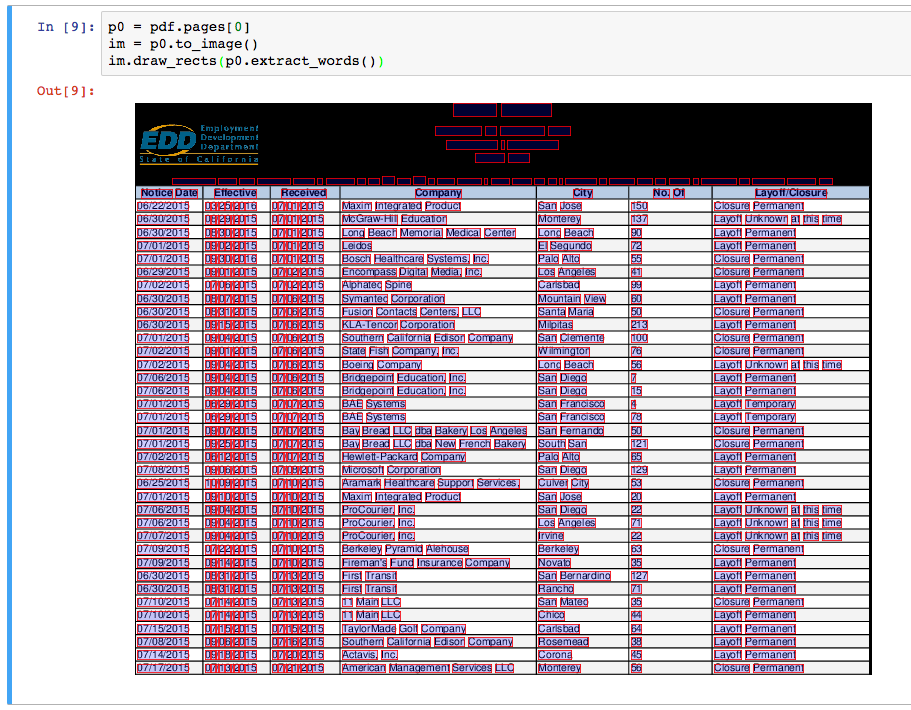

# PDFPlumber `v0.5.14`

Plumb a PDF for detailed information about each text character, rectangle, and line. Plus: Table extraction and visual debugging.

Works best on machine-generated, rather than scanned, PDFs. Built on [`pdfminer`](https://github.com/euske/pdfminer) and [`pdfminer.six`](https://github.com/goulu/pdfminer). 

Currently [tested](tests/) on [Python 2.7, 3.1, 3.4, 3.5, and 3.6](tox.ini).

## Table of Contents

- [Installation](#installation)
- [Command line interface](#command-line-interface)
- [Python library](#python-library)
- [Visual debugging](#visual-debugging)
- [Extracting tables](#extracting-tables)
- [Extracting form values](#extracting-form-values)
- [Demonstrations](#demonstrations)
- [Acknowledgments / Contributors](#acknowledgments--contributors)
- [Contributing](#contributing)

## Installation

```sh
pip install pdfplumber
```

To use `pdfplumber`'s visual-debugging tools, you'll also need to have [`ImageMagick`](https://www.imagemagick.org/) installed on your computer. [Installation instructions here](http://docs.wand-py.org/en/latest/guide/install.html#install-imagemagick-debian).

## Command line interface

### Basic example

```sh
curl "https://cdn.rawgit.com/jsvine/pdfplumber/master/examples/pdfs/background-checks.pdf" > background-checks.pdf
pdfplumber < background-checks.pdf > background-checks.csv
```

The output will be a CSV containing info about every character, line, and rectangle in the PDF.

### Options

| Argument | Description |
|----------|-------------|
|`--format [format]`| `csv` or `json`. The `json` format returns slightly more information; it includes PDF-level metadata and height/width information about each page.|
|`--pages [list of pages]`| A space-delimited, `1`-indexed list of pages or hyphenated page ranges. E.g., `1, 11-15`, which would return data for pages 1, 11, 12, 13, 14, and 15.|
|`--types [list of object types to extract]`| Choices are `char`, `anno`, `line`, `curve`, `rect`, `rect_edge`. Defaults to `char`, `anno`, `line`, `curve`, `rect`.|

## Python library

### Basic example

```python
import pdfplumber

with pdfplumber.open("path/to/file.pdf") as pdf:
    first_page = pdf.pages[0]
    print(first_page.chars[0])
```

### Loading a PDF

`pdfplumber` provides two main ways to load a PDF:

- `pdfplumber.open("path/to/file.pdf")`
- `pdfplumber.load(file_like_object)`

Both methods return an instance of the `pdfplumber.PDF` class.

To load a password-protected PDF, pass the `password` keyword argument, e.g., `pdfplumber.open("file.pdf", password = "test")`.

### The `pdfplumber.PDF` class

The top-level `pdfplumber.PDF` class represents a single PDF and has two main properties:

| Property | Description |
|----------|-------------|
|`.metadata`| A dictionary of metadata key/value pairs, drawn from the PDF's `Info` trailers. Typically includes "CreationDate," "ModDate," "Producer," et cetera.|
|`.pages`| A list containing one `pdfplumber.Page` instance per page loaded.|

### The `pdfplumber.Page` class

The `pdfplumber.Page` class is at the core of `pdfplumber`. Most things you'll do with `pdfplumber` will revolve around this class. It has these main properties:

| Property | Description |
|----------|-------------|
|`.page_number`| The sequential page number, starting with `1` for the first page, `2` for the second, and so on.|
|`.width`| The page's width.|
|`.height`| The page's height.|
|`.objects` / `.chars` / `.lines` / `.rects`| Each of these properties is a list, and each list contains one dictionary for each such object embedded on the page. For more detail, see "[Objects](#objects)" below.|

... and these main methods:

| Method | Description |
|--------|-------------|
|`.crop(bounding_box)`| Returns a version of the page cropped to the bounding box, which should be expressed as 4-tuple with the values `(x0, top, x1, bottom)`. Cropped pages retain objects that fall at least partly within the bounding box. If an object falls only partly within the box, its dimensions are sliced to fit the bounding box.|
|`.within_bbox(bounding_box)`| Similar to `.crop`, but only retains objects that fall *entirely* within the bounding box.|
|`.filter(test_function)`| Returns a version of the page with only the `.objects` for which `test_function(obj)` returns `True`.|
|`.extract_text(x_tolerance=0, y_tolerance=0)`| Collates all of the page's character objects into a single string. Adds spaces where the difference between the `x1` of one character and the `x0` of the next is greater than `x_tolerance`. Adds newline characters where the difference between the `doctop` of one character and the `doctop` of the next is greater than `y_tolerance`.|
|`.extract_words(x_tolerance=0, y_tolerance=0)`| Returns a list of all word-looking things and their bounding boxes. Words are considered to be sequences of characters where the difference between the `x1` of one character and the `x0` of the next is less than or equal to `x_tolerance` *and* where the `doctop` of one character and the `doctop` of the next is less than or equal to `y_tolerance`.|
|`.extract_tables(table_settings)`| Extracts tabular data from the page. For more details see "[Extracting tables](#extracting-tables)" below.|
|`.to_image(**conversion_kwargs)`| Returns an instance of the `PageImage` class. For more details, see "[Visual debugging](#visual-debugging)" below. For conversion_kwargs, see [here](http://docs.wand-py.org/en/latest/wand/image.html#wand.image.Image).|

### Objects

Each instance of `pdfplumber.PDF` and `pdfplumber.Page` provides access to four types of PDF objects. The following properties each return a Python list of the matching objects:

- `.chars`, each representing a single text character.
- `.annos`, each representing a single annotation-text character.
- `.lines`, each representing a single 1-dimensional line.
- `.rects`, each representing a single 2-dimensional rectangle.
- `.curves`, each representing a series of connected points.

Each object is represented as a simple Python `dict`, with the following properties:

#### `char` / `anno` properties

| Property | Description |
|----------|-------------|
|`page_number`| Page number on which this character was found.|
|`text`| E.g., "z", or "Z" or " ".|
|`fontname`| Name of the character's font face.|
|`size`| Font size.|
|`adv`| Equal to text width * the font size * scaling factor.|
|`upright`| Whether the character is upright.|
|`height`| Height of the character.|
|`width`| Width of the character.|
|`x0`| Distance of left side of character from left side of page.|
|`x1`| Distance of right side of character from left side of page.|
|`y0`| Distance of bottom of character from bottom of page.|
|`y1`| Distance of top of character from bottom of page.|
|`top`| Distance of top of character from top of page.|
|`bottom`| Distance of bottom of the character from top of page.|
|`doctop`| Distance of top of character from top of document.|
|`object_type`| "char" / "anno"|

#### `line` properties

| Property | Description |
|----------|-------------|
|`page_number`| Page number on which this line was found.|
|`height`| Height of line.|
|`width`| Width of line.|
|`x0`| Distance of left-side extremity from left side of page.|
|`x1`| Distance of right-side extremity from left side of page.|
|`y0`| Distance of bottom extremity from bottom of page.|
|`y1`| Distance of top extremity bottom of page.|
|`top`| Distance of top of line from top of page.|
|`bottom`| Distance of bottom of the line from top of page.|
|`doctop`| Distance of top of line from top of document.|
|`linewidth`| Thickness of line.|
|`object_type`| "line"|

#### `rect` properties

| Property | Description |
|----------|-------------|
|`page_number`| Page number on which this rectangle was found.|
|`height`| Height of rectangle.|
|`width`| Width of rectangle.|
|`x0`| Distance of left side of rectangle from left side of page.|
|`x1`| Distance of right side of rectangle from left side of page.|
|`y0`| Distance of bottom of rectangle from bottom of page.|
|`y1`| Distance of top of rectangle from bottom of page.|
|`top`| Distance of top of rectangle from top of page.|
|`bottom`| Distance of bottom of the rectangle from top of page.|
|`doctop`| Distance of top of rectangle from top of document.|
|`linewidth`| Thickness of line.|
|`object_type`| "rect"|

#### `curve` properties

| Property | Description |
|----------|-------------|
|`page_number`| Page number on which this curve was found.|
|`points`| Points — as a list of `(x, top)` tuples — describing the curve.|
|`height`| Height of curve's bounding box.|
|`width`| Width of curve's bounding box.|
|`x0`| Distance of curve's left-most point from left side of page.|
|`x1`| Distance of curve's right-most point from left side of the page.|
|`y0`| Distance of curve's lowest point from bottom of page.|
|`y1`| Distance of curve's highest point from bottom of page.|
|`top`| Distance of curve's highest point from top of page.|
|`bottom`| Distance of curve's lowest point from top of page.|
|`doctop`| Distance of curve's highest point from top of document.|
|`linewidth`| Thickness of line.|
|`object_type`| "curve"|

Additionally, both `pdfplumber.PDF` and `pdfplumber.Page` provide access to two derived lists of objects: `.rect_edges` (which decomposes each rectangle into its four lines) and `.edges` (which combines `.rect_edges` with `.lines`). 

## Visual debugging

### Creating a `PageImage` with `.to_image()`

To turn any page (including cropped pages) into an `PageImage` object, call `my_page.to_image()`. You can optionally pass a `resolution={integer}` keyword argument, which defaults to 72. E.g.:

```python
im = my_pdf.pages[0].to_image(resolution=150)
```

`PageImage` objects play nicely with IPython/Jupyter notebooks; they automatically render as cell outputs. For example:




### Basic `PageImage` methods

| Method | Description |
|--------|-------------|
|`im.reset()`| Clears anything you've drawn so far.|
|`im.copy()`| Copies the image to a new `PageImage` object.|
|`im.save(path_or_fileobject, format="PNG")`| Saves the annotated image.|

### Drawing methods

You can pass explicit coordinates or any `pdfplumber` PDF object (e.g., char, line, rect) to these methods.

| Single-object method | Bulk method | Description |
|----------------------|-------------|-------------|
|`im.draw_line(line, stroke={color}, stroke_width=1)`| `im.draw_lines(list_of_lines, **kwargs)`| Draws a line from a `line`, `curve`, or a 2-tuple of 2-tuples (e.g., `((x, y), (x, y))`).|
|`im.draw_vline(location, stroke={color}, stroke_width=1)`| `im.draw_vlines(list_of_locations, **kwargs)`| Draws a vertical line at the x-coordinate indicated by `location`.|
|`im.draw_hline(location, stroke={color}, stroke_width=1)`| `im.draw_hlines(list_of_locations, **kwargs)`| Draws a horizontal line at the y-coordinate indicated by `location`.|
|`im.draw_rect(bbox_or_obj, fill={color}, stroke={color}, stroke_width=1)`| `im.draw_rects(list_of_rects, **kwargs)`| Draws a rectangle from a `rect`, `char`, etc., or 4-tuple bounding box.|
|`im.draw_circle(center_or_obj, radius=5, fill={color}, stroke={color})`| `im.draw_circles(list_of_circles, **kwargs)`| Draws a circle at `(x, y)` coordinate or at the center of a `char`, `rect`, etc.|

Note: The methods above are built on Pillow's [`ImageDraw` methods](http://pillow.readthedocs.io/en/latest/reference/ImageDraw.html), but the parameters have been tweaked for consistency with SVG's `fill`/`stroke`/`stroke_width` nomenclature.

### Troubleshooting ImageMagick on Debian-based systems

If you're using `pdfplumber` on a Debian-based system and encounter a `PolicyError`, you may be able to fix it by changing the following line in `/etc/ImageMagick-6/policy.xml` from this:

```xml
<policy domain="coder" rights="none" pattern="PDF" />
```

... to this:

```xml
<policy domain="coder" rights="read|write" pattern="PDF" />
```

(More details about `policy.xml` [available here](https://imagemagick.org/script/security-policy.php).)

## Extracting tables

`pdfplumber`'s approach to table detection borrows heavily from [Anssi Nurminen's master's thesis](http://dspace.cc.tut.fi/dpub/bitstream/handle/123456789/21520/Nurminen.pdf?sequence=3), and is inspired by [Tabula](https://github.com/tabulapdf/tabula-extractor/issues/16). It works like this:

1. For any given PDF page, find the lines that are (a) explicitly defined and/or (b) implied by the alignment of words on the page.
2. Merge overlapping, or nearly-overlapping, lines.
3. Find the intersections of all those lines.
4. Find the most granular set of rectangles (i.e., cells) that use these intersections as their vertices.
5. Group contiguous cells into tables. 

### Table-extraction methods

`pdfplumber.Page` objects can call the following table methods:

| Method | Description |
|--------|-------------|
|`.find_tables(table_settings={})`|Returns a list of `Table` objects. The `Table` object provides access to the `.cells`, `.rows`, and `.bbox` properties, as well as the `.extract(x_tolerance=3, y_tolerance=3)` method.|
|`.extract_tables(table_settings={})`|Returns the text extracted from *all* tables found on the page, represented as a list of lists of lists, with the structure `table -> row -> cell`.|
|`.extract_table(table_settings={})`|Returns the text extracted from the *largest* table on the page, represented as a list of lists, with the structure `row -> cell`. (If multiple tables have the same size — as measured by the number of cells — this method returns the table closest to the top of the page.)|
|`.debug_tablefinder(table_settings={})`|Returns an instance of the `TableFinder` class, with access to the `.edges`, `.intersections`, `.cells`, and `.tables` properties.|

For example:

```python
pdf = pdfplumber.open("path/to/my.pdf")
page = pdf.pages[0]
page.extract_table()
```

[Click here for a more detailed example.](examples/notebooks/extract-table-ca-warn-report.ipynb)

### Table-extraction settings

By default, `extract_tables` uses the page's vertical and horizontal lines (or rectangle edges) as cell-separators. But the method is highly customizable via the `table_settings` argument. The possible settings, and their defaults:

```python
{
    "vertical_strategy": "lines", 
    "horizontal_strategy": "lines",
    "explicit_vertical_lines": [],
    "explicit_horizontal_lines": [],
    "snap_tolerance": 3,
    "join_tolerance": 3,
    "edge_min_length": 3,
    "min_words_vertical": 3,
    "min_words_horizontal": 1,
    "keep_blank_chars": False,
    "text_tolerance": 3,
    "text_x_tolerance": None,
    "text_y_tolerance": None,
    "intersection_tolerance": 3,
    "intersection_x_tolerance": None,
    "intersection_y_tolerance": None,
}
```

| Setting | Description |
|---------|-------------|
|`"vertical_strategy"`| Either `"lines"`, `"lines_strict"`, `"text"`, or `"explicit"`. See explanation below.|
|`"horizontal_strategy"`| Either `"lines"`, `"lines_strict"`, `"text"`, or `"explicit"`. See explanation below.|
|`"explicit_vertical_lines"`| A list of vertical lines that explicitly demarcate cells in the table. Can be used in combination with any of the strategies above. Items in the list should be either numbers — indicating the `x` coordinate of a line the full height of the page — or a dictionary describing the line, with at least the following keys: `x`, `top`, `bottom`. |
|`"explicit_horizontal_lines"`| A list of vertical lines that explicitly demarcate cells in the table. Can be used in combination with any of the strategies above. Items in the list should be either numbers — indicating the `y` coordinate of a line the full height of the page — or a dictionary describing the line, with at least the following keys: `top`, `x0`, `x1`.|
|`"snap_tolerance"`| Parallel lines within `snap_tolerance` pixels will be "snapped" to the same horizontal or vertical position.|
|`"join_tolerance"`| Line segments on the same infinite line, and whose ends are within `join_tolerance` of one another, will be "joined" into a single line segment.|
|`"edge_min_length"`| Edges shorter than `edge_min_length` will be discarded before attempting to reconstruct the table.|
|`"min_words_vertical"`| When using `"vertical_strategy": "text"`, at least `min_words_vertical` words must share the same alignment.|
|`"min_words_horizontal"`| When using `"horizontal_strategy": "text"`, at least `min_words_horizontal` words must share the same alignment.|
|`"keep_blank_chars"`| When using the `text` strategy, consider `" "` chars to be *parts* of words and not word-separators.|
|`"text_tolerance"`, `"text_x_tolerance"`, `"text_y_tolerance"`| When the `text` strategy searches for words, it will expect the individual letters in each word to be no more than `text_tolerance` pixels apart.|
|`"intersection_tolerance"`, `"intersection_x_tolerance"`, `"intersection_y_tolerance"`| When combining edges into cells, orthogonal edges must be within `intersection_tolerance` pixels to be considered intersecting.|

### Table-extraction strategies

Both `vertical_strategy` and `horizontal_strategy` accept the following options:

| Strategy | Description | 
|----------|-------------|
| `"lines"` | Use the page's graphical lines — including the sides of rectangle objects — as the borders of potential table-cells. |
| `"lines_strict"` | Use the page's graphical lines — but *not* the sides of rectangle objects — as the borders of potential table-cells. |
| `"text"` | For `vertical_strategy`: Deduce the (imaginary) lines that connect the left, right, or center of words on the page, and use those lines as the borders of potential table-cells. For `horizontal_strategy`, the same but using the tops of words. |
| `"explicit"` | Only use the lines explicitly defined in `explicit_vertical_lines` / `explicit_horizontal_lines`. |

### Notes

- Often it's helpful to crop a page — `Page.crop(bounding_box)` — before trying to extract the table.

- Table extraction for `pdfplumber` was radically redesigned for `v0.5.0`, and introduced breaking changes.


## Extracting form values

Sometimes PDF files can contain forms that include inputs that people can fill out and save. While values in form fields appear like other text in a PDF file, form data is handled differently. If you want the gory details, see page 671 of this [specification](https://www.adobe.com/content/dam/acom/en/devnet/pdf/pdf_reference_archive/pdf_reference_1-7.pdf).

`pdfplumber` doesn't have an interface for working with form data, but you can access it using `pdfplumber`'s wrappers around `pdfminer`.

For example, this snippet will retrieve form field names and values and store them in a dictionary. You may have to modify this script to handle cases like nested fields (see page 676 of the specification).

```python
pdf = pdfplumber.open("document_with_form.pdf")

fields = pdf.doc.catalog["AcroForm"].resolve()["Fields"]

form_data = {}

for field in fields:
    field_name = field.resolve()["T"]
    field_value = field.resolve()["V"]
    form_data[field_name] = field_value
```


## Demonstrations

- [Using `extract_table` on a California Worker Adjustment and Retraining Notification (WARN) report](examples/notebooks/extract-table-ca-warn-report.ipynb). Demonstrates basic visual debugging and table extraction.
- [Using `extract_table` on the FBI's National Instant Criminal Background Check System PDFs](examples/notebooks/extract-table-nics.ipynb). Demonstrates how to use visual debugging to find optimal table extraction settings. Also demonstrates `Page.crop(...)` and `Page.extract_text(...).`
- [Inspecting and visualizing `curve` objects](examples/notebooks/ag-energy-roundup-curves.ipynb).
- [Extracting fixed-width data from a San Jose PD firearm search report](examples/notebooks/san-jose-pd-firearm-report.ipynb), an example of using `Page.extract_text(...)`.

## Acknowledgments / Contributors

Many thanks to the following users who've contributed ideas, features, and fixes:

- [Jacob Fenton](https://github.com/jsfenfen)
- [Dan Nguyen](https://github.com/dannguyen)
- [Jeff Barrera](https://github.com/jeffbarrera)
- [Bob Lannon](https://github.com/boblannon)
- [Dustin Tindall](https://github.com/dustindall)
- [@yevgnen](https://github.com/Yevgnen)
- [@meldonization](https://github.com/meldonization)
- [Oisín Moran](https://github.com/OisinMoran)
- [Samkit Jain](https://github.com/samkit-jain)

## Contributing

Pull requests are welcome, but please submit an issue (or email jsvine@gmail.com) before submitting one, as the library is in active development. The current development branch is `v0.6.0`.
